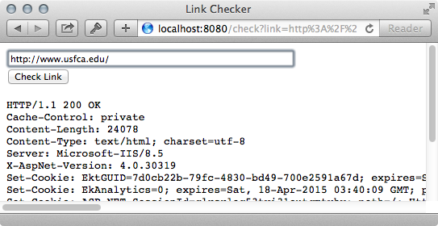
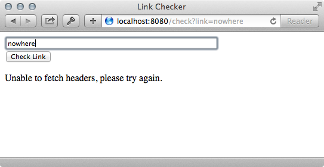

HTTP Header Server
=================================================

For this assignment, you will create a simple Jetty web server that allows users enter a URL, and view the HTTP headers for that URL.

Setup
-------------------------------------------------

Before startingthis assignment, you should install Jetty and servlets as a third-party libraries in Eclipse. See the class slides for links to the necessary `jar` files.

Requirements
-------------------------------------------------

You must do the following for this assignment:

1. **`HTTPHeaderServer.main():`** Start a Jetty web server on port 8080, and map `/check` to the `HeaderServlet` servlet.

2. **`HTTPHeaderServer.getHeaders()`** Returns HTTP headers for a specified link as a `String` object. 
 
  Note that [`BufferedReader.readLine()`](http://docs.oracle.com/javase/7/docs/api/java/io/BufferedReader.html#readLine()) removes `\n` newline characters, so you may need to add them back into your output. 

  You are welcome to use the [`HeaderFetcher`](https://github.com/cs212/demos/blob/master/Sockets%20and%20HTTP/src/HeaderFetcher.java) demo as a starting point.

3. **`HTTPHeaderServer.HeaderServlet.doGet()`** First, this servlet should display a simple web form that allows users to enter a link, and press a button to display the HTTP headers for that link.

  If the appropriate link parameter is present in the `GET` request, the servlet should also fetch and display the HTTP headers for the provided link. If the servlet is unable to fetch the headers, display a message on the web page instead.

Below is one example for how this assignment might look. You can use any of the servlet code provided as a starting point.

Examples
-------------------------------------------------

The following is one example implementation of this assignment. The exact appearance does not need to match this.

When a valid link is provided, the resulting web page might look as follows:



When an invalid link is provided, the resulting web page might look as follows:



The basic HTML generated by the servlet (with no link) looks as follows:

```
<html>
<head><title>Link Checker</title></head>
<body>

<form method="get" action="/check">
<p>
<input type="text" name="link" maxlength="50" size="50">
<br>
<input type="submit" value="Check Link">
</p>
</form>

<p>Please enter a valid link to check.</p>

</body>
</html>
```

A `<pre>` tag is used to display the header text.

Submission
-------------------------------------------------

Place these two classes in the proper location of your code repository. Additional details can be found on the [course website](http://cs212.cs.usfca.edu).

There are no unit tests for this homework assignment. You can receive credit by demonstrating your homework during lab. 
